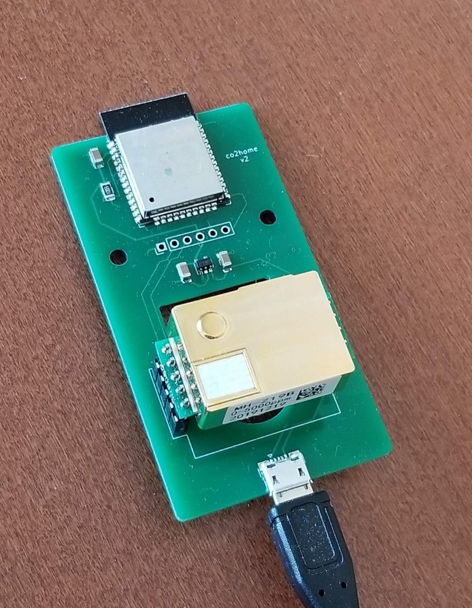
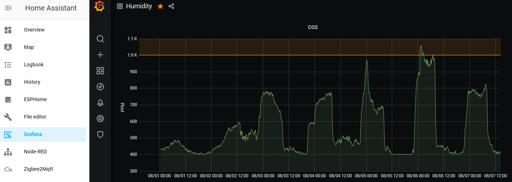

# co2home
This device interfaces with an MH-Z19B and makes the data available in home assistant via esphome. It could also work with any other software you'd like on an ESP32.

Phyiscally, this should also work with the Senseair S8 as it has the same pinouts. ESPHome provides a <a href="https://esphome.io/components/sensor/senseair.html">different block</a> to work with this.

## Narrative
With COVID hitting and basically spending the tail end of Winter and a lot of spring indoors 24x7, I really wanted to check out the indoor air quality. My house does have an ERV, but it was basically a guessing game. No matter how efficient an ERV/HRV is, there is still a penalty to pay. I wanted a way to quantify the levels to adjust my HRV accordingly.

Now with HA and Grafana, I've dialed it in. I have the sensor in my bedroom, but I have just built another board, and I hope to put it somewhere near (or in) a duct to meter the overall CO2 levels in the house. I do want my air handler fan settings to keep the bedroom to acceptable levels at night.

I've found now that 10 minutes an hour is not quite enough ERV time with the CFM I've selected to run it at. Throughout the day, the CO2 level will slowly rise. However, at 20 minutes/hour, it is bringing in enough fresh air to keep levels from rising too much!

Overkill, sure, but hey, why not?

## Programming
You MUST remove the sensor module to perform any serial flashing with a programmer. Doing OTA updates is not an issue; the sensor can be left attached.

The programming header can work with any esp32 programmer if wired up correctly. The pinout matches my esp32 programmer, <a href="https://github.com/gcormier/eflashy32/">eflashy32</a> if you are in need of a programmer as well.